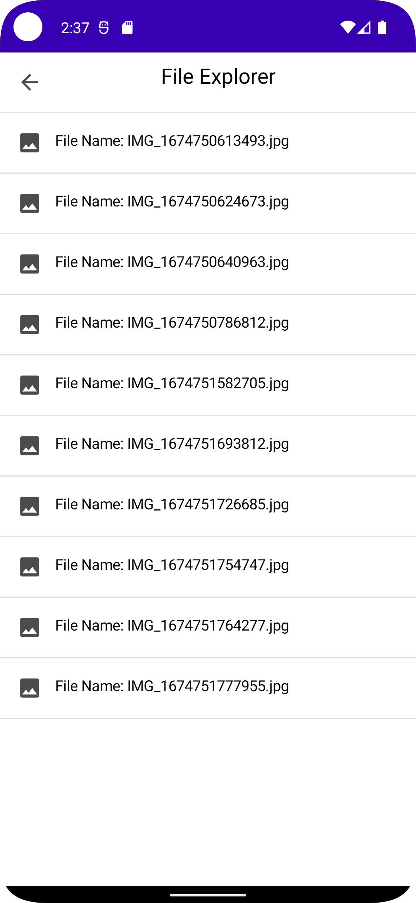
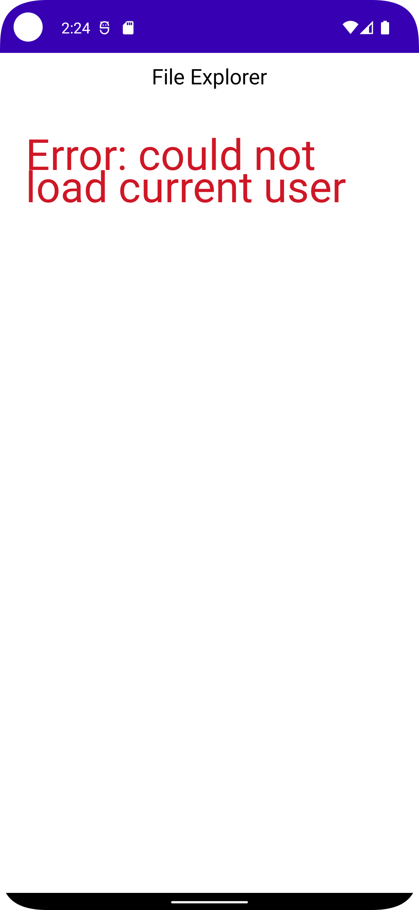

# FileHierarchy

## Project Notes

The following features and techniques have been implemented/used:
* `Retrofit` for Rest API
* Repository for getting data from the network and mapping to model/domain
* MVI architecture is used for presentation/view layer, utilising [Blockchain.com MVI](https://github.com/blockchain/My-Wallet-V3-Android/blob/master/commonarch/src/main/java/com/blockchain/commonarch/presentation/mvi_v2/MVI.kt)
* Unit-tests with `JUnit4`, `mockk` and `Turbine` for [HomeViewModel](https://github.com/The-Shader/FileHierarchy/blob/main/app/src/test/java/com/fireblade/filehierarchy/HomeViewModelTests.kt)
* Compose for UI
* `Koin` for dependency injection
* `Kotlinx Serialization` for de/serializing data through the network layer
* `Kotlinx Coroutines` for async data processing
* `Either` from `Arrow Core` to handle exceptions
* The login credentials have been hard-coded for now

Missing/can be improved:
* Local caching using `Room` or `SQLDelight`
* Better state handling with init-state and timeouts on failing to load
* Start using styles and themes instead of hard-coded padding etc.
* More unit-tests(for the ViewModel and for the repository) and UI tests
* More specific error-handling by parsing the error codes with `Either`
* Introducing loading states and loading indicators
* Separate viewmodel for the `ImageView`
* Bitrise integration for continuous integration and automatic deploy into the Play store
* Firebase integration for crash and user analytics

# Screens

|Initial|Error|Image|
| -- | -- | -- |
|  |  |  |
